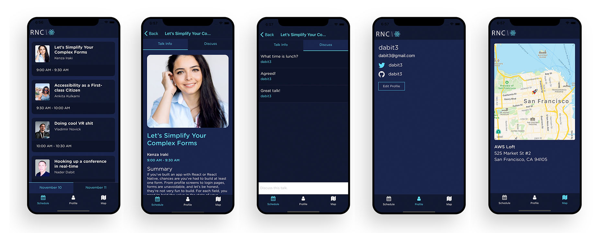
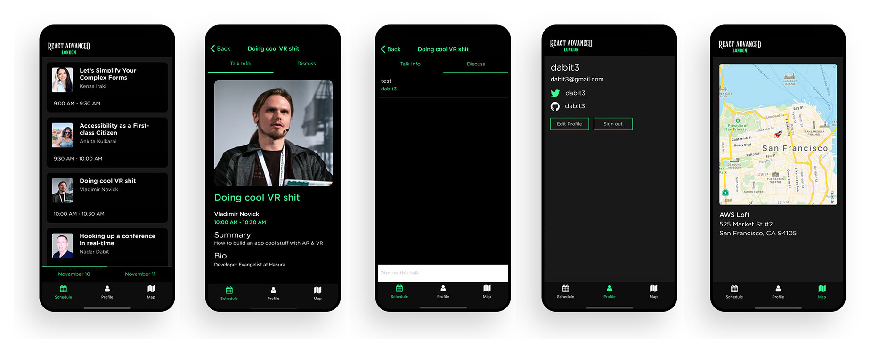
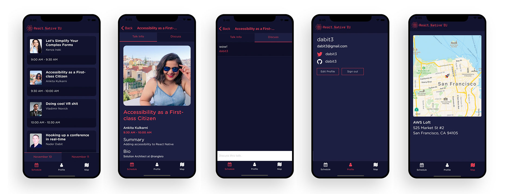

# Conference App in a Box

#### Deploy a full stack & cross-platform mobile app for your next event in minutes.

🛠 Built with React Native, GraphQL, AWS Amplify, & AWS AppSync

### Features

⚡️ Real-time chat   
👾 Themeable & customizable   
👮‍♂️ Authentication & Profile view   
🔥 Serverless back end   
🚀 GraphQL   





## Deploy the back end and run the app

1. Clone the repo & install the dependencies

```sh
git clone git@github.com:dabit3/conference-app-in-a-box.git

cd conference-app-in-a-box

npm install
```

2. Initialize and deploy the Amplify project

```sh
amplify init

amplify push
```

## To populate the database with your conference speakers

1. Sign up in the app after following the previous steps

2. Open the AppSync console:

```sh
amplify console api
```

3. Click on __Queries__ to open the GraphiQL Editor

4. Create mutations with the following template:

```sh
mutation createTalk {
  createTalk(input: {
    name: "Performance In React Native",
    summary: "In this talk, we will look at the various tips and tricks for taking full advantage of React Native and using the performance attributes of the new architecture.",
    speakerName: "Ram Narasimhan",
    speakerBio: "Software Engineer at Facebook",
    time: "9:00 AM - 9:30 AM",
    timeStamp: "1573491600",
    date: "November 11",
    location: "Armory",
    speakerAvatar: "https://pbs.twimg.com/profile_images/875450414161772544/UjefWmmL_400x400.jpg"
  }) {
    id name speakerBio speakerName speakerAvatar
    location date time timeStamp
  }
}
```

## To customize with your theme and logo

1. Open __src/theme.js__ and replace the _highlight_ & _primary_ colors.

2. Replace __src/assets/logo.jpg__ with your logo.
